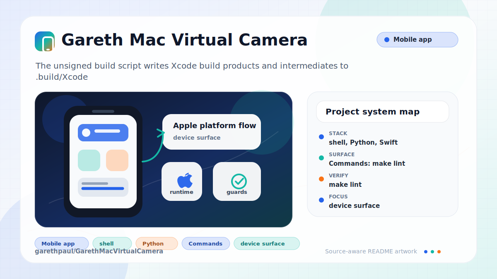

# Gareth Mac Virtual Camera

<!-- README-OVERVIEW-IMAGE -->


A macOS CoreMediaIO camera extension packaged in a SwiftUI host app. The extension publishes the bundled `Extension/video.mp4` as a virtual camera named `Gareth Video Cam`.

## Current Target

- Stable CI toolchain: Xcode 26.5 with the macOS 26.5 SDK
- Swift 6 language mode
- Stable macOS compatibility reference: macOS Tahoe 26.5.1
- Deployment target: macOS 14.0 or later
- Pre-release watch items as of June 9, 2026: Xcode 26.6 beta, macOS 26.6 beta (25G5028f), Xcode 27 beta (27A5194q), and macOS 27 beta (26A5353q); keep CI on stable Xcode 26.5 until those prerelease toolchains are stable and available on GitHub-hosted runners.
- Host app bundle ID: `com.garethpaul.GarethVideoCam`
- Camera extension bundle ID: `com.garethpaul.GarethVideoCam.Extension`

## Build And Run

Open `GarethVideoCam.xcodeproj` in Xcode, select the shared `GarethVideoCam` scheme, then build and run.

The shared scheme replaces `/Applications/GarethVideoCam.app` with the freshly built app before launch. macOS only activates system extensions from apps located in `/Applications`.

## Validate

This workspace does not require Xcode for local validation checks:

```sh
./scripts/check_project.sh
```

The same baseline is available through the conventional repository entry point:

```sh
make check
```

The check script runs project metadata validation, validator mutation tests for recent runtime-readiness guardrails, build-log scanner tests, unsigned build script tests, runtime diagnostics tests, build-product verifier tests, shell syntax checks, and whitespace checks. The build-product verifier checks bundle identifiers, aligned bundle versions, declared executables, display metadata, product-specific privacy usage strings, bundled runtime diagnostics self-tests, resolved CoreMediaIO extension metadata, and bundled-video resource metadata. The validator also checks exact host and extension entitlement keys, shared app-group values, Xcode entitlement file bindings, the bundled `Extension/video.mp4` for parseable dimensions, frame rate, and positive video duration, and the extension's decoded pixel-buffer guards so resource and stream-format regressions fail before runtime activation.

For a CI-equivalent unsigned compile on macOS with Xcode installed:

```sh
./scripts/build_unsigned.sh
./scripts/scan_build_log.py build-Debug.log build-Release.log
```

The unsigned build script writes Xcode build products and intermediates to
`.build/Xcode` by default; set `BUILD_OUTPUT_PATH` to override it.
Configuration names passed to the script are validated before build log paths
are created.

Pushes and pull requests to `main` also run `.github/workflows/macos-build.yml` on GitHub's `macos-26` runner. That workflow runs `make check`, performs unsigned Debug and Release target builds, verifies the built app products contain the embedded system extension, aligned bundle versions, declared executables, display metadata, product-specific privacy usage strings, bundled runtime diagnostics self-tests, resolved CoreMediaIO extension metadata, and bundled-video metadata, captures the Xcode logs, and fails on source warnings, errors, build-failed and test-failed banners, build or test failure summaries, or nonzero Xcode command failures. Xcode 26.5 currently emits an AppIntents metadata processor notice for targets without AppIntents; CI filters only that known tool notice.

## Runtime Activation

Runtime activation still requires a macOS host with a valid Apple Developer signing identity, the System Extension entitlement, and user approval in System Settings. The app must run from `/Applications/GarethVideoCam.app`; the shared Xcode scheme replaces the app there before launch for local testing.

The app disables install actions when it is not running from `/Applications/GarethVideoCam.app`, when the host app bundle identifier does not match the expected identifier, when the host app executable is missing or not runnable, when its app signature is invalid across any architecture slice, when the signed app is missing the System Extension entitlement, when the app and embedded extension bundle versions do not match, when the embedded extension executable or CMIO Mach service metadata is missing, unresolved, or unexpected, when the embedded `video.mp4` resource is missing, empty, or has unexpected metadata, when the bundled system extension signature is invalid across any architecture slice, when the embedded system extension carries the host-only System Extension entitlement, when the app and extension do not share an expected app-group entitlement, or when the app and extension signing Team IDs are missing, differ, or vary across architecture slices. The uninstall action is separately gated by the host app path, bundle identifier, executable, all-architecture signature validation, and System Extension entitlement, so it keeps uninstall available when only activation packaging checks fail. It reports extension metadata and bundled-video packaging blockers as distinct readiness states, reports extension load failures separately from unchecked or invalid signatures, refreshes readiness when the app becomes active, shows and copies a readiness summary with ready, blocked, and pending counts, next action, and checklist for those activation gates, includes a Runtime Evidence section with the expected signed-host diagnostics, collection command, and command source, can copy the exact expected runtime evidence lines, can copy a signed runtime activation checklist with the expected diagnostics lines and collection command plus current request detail, readiness summary, and last recorded failure, can copy the exact bundled runtime diagnostics command for signed-host evidence collection, exposes a primary System Settings approval shortcut when macOS is waiting for user approval, can reveal the app and embedded extension in Finder, and can copy a diagnostics snapshot with a generation timestamp, activation and deactivation request readiness and details, macOS version, bundle identifiers, exact app and extension short/build bundle versions, bundle short/build version match status, the expected and current app paths, host app executable path and check status, runtime diagnostics command source, expected signed-host evidence lines, app and extension quarantine status, app and extension signing status, extension load failure status, extension host-only entitlement status, signed app-group values and match status, Team IDs, bundled extension executable, resolved CMIO Mach service status, CMIO Mach service identifier match status, extension executable check status, bundled-video size and metadata values, the pending request direction, the last recorded failure, and timestamped recent request activity with severity.

Signed runtime activation checklist:

1. Build with an Apple Developer team that has the System Extension entitlement and app-group entitlement.
2. Run the shared Xcode scheme so it replaces `/Applications/GarethVideoCam.app`, then open the app from that path.
3. Confirm the in-app readiness summary has no blocked checks, then choose Install.
4. Approve the pending camera extension in System Settings if macOS requests approval.
5. Use the Runtime Evidence section's Copy Command action, then run the copied command on the signed macOS host.
6. Confirm the diagnostics report the expected signed-host evidence lines:

```text
Runtime readiness result: ready
Application location ready: yes
App bundle identifier ready: yes
App signature ready: yes
App System Extension entitlement ready: yes
App executable ready: yes
Extension bundle identifier ready: yes
Extension signature ready: yes
Extension host-only entitlement absent: yes
Extension executable ready: yes
Extension CMIO Mach service ready: yes
Bundle versions match ready: yes
Signing Team match ready: yes
Application group match ready: yes
Bundled video ready: yes
Bundled video metadata ready: yes
Runtime activation evidence result: active
Extension registration entry present: yes
Extension registration activated enabled: yes
Expected virtual camera device present: yes
```

The Runtime Evidence section reports whether the copied command is using the bundled app resource or a repository fallback.

The Camera menu provides keyboard shortcuts for repeated evidence collection: Command-R refreshes status, Command-Shift-C copies diagnostics, Command-Shift-L copies the activation checklist, Command-Shift-D copies the runtime diagnostics command, and Command-Shift-E copies the expected runtime evidence lines.

After approval, camera pickers should list `Gareth Video Cam`.

To collect runtime evidence from a signed macOS host:

```sh
./scripts/collect_runtime_diagnostics.sh /Applications/GarethVideoCam.app
```

Pass a second argument to change the unified-log window, for example `1h`.

The diagnostics script reports host tool versions, diagnostics helper resource paths and parser availability, app and extension Info.plist bundle versions and identifiers, app/extension bundle-version match status, bundled-video byte size, checksum, metadata, metadata readiness for expected dimensions/frame rate and positive duration, expected application-location and bundle identifier checks, app executable metadata and architecture slices, quarantine attributes, all-architecture code-signing status and signature details, matching Team IDs across architecture slices, Gatekeeper assessment, signed entitlements across architecture slices, explicit host and extension System Extension entitlement checks that mark unreadable signed entitlements as unknown and run across architecture slices, signed app-group values and match readiness that mark unreadable app-group entitlements as unknown and use only values present across architecture slices, a counted runtime-readiness summary with a next-action hint, embedded system-extension executable metadata and architecture slices, resolved CMIO Mach service status, `systemextensionsctl` registration presence, activated/enabled state, matching entries, and full list output, expected virtual-camera device presence with full camera inventory, unknown runtime activation evidence when `systemextensionsctl` or `system_profiler` fail, a counted runtime-activation evidence summary with a next-action hint, running app/extension processes, recent `com.garethpaul.GarethVideoCam` unified logs, and recent system-extension/CMIO log context.
